# Hybrid RAG Engine

> 🧠 A secure, Django-powered Retrieval-Augmented Generation (RAG) service for asking grounded questions over an administratively managed document knowledge base.

Hybrid RAG Engine combines semantic retrieval from **ChromaDB** with lexical retrieval from **BM25**, then reranks the combined candidates before sending focused context to an OpenRouter-hosted language model. Documents, API keys, users, and Q&A telemetry are managed through Django Admin.

## Features

| Area | Capability |
| --- | --- |
| 🔎 Hybrid retrieval | Combines ChromaDB vector similarity search with BM25 keyword search for strong semantic and exact-term recall. |
| 🧩 Reranking | Uses a cross-encoder to rank retrieved candidates before answer generation. |
| 📄 Document ingestion | Supports PDF, DOCX, and TXT; extracts, normalizes, chunks, embeds, and indexes uploads in the background. |
| 🔐 API protection | RAG API endpoints require an API key supplied through the custom `X-API-Key` header. |
| 🛡️ Browser request security | The built-in chat UI sends both `X-API-Key` and Django's `X-CSRFToken` with its fetch request. |
| 🧹 No ghost documents | Deleting a document in Django Admin removes its uploaded file and purges its ChromaDB vectors and BM25 entries. |
| 📊 Traceability | Django Admin records Q&A history, request status, retrieval latency, selected chunks, and model metadata. |
| 🐳 Docker-ready | Docker Compose provides a consistent local runtime with persistent project-local data. |

## Architecture

```text
Document upload → extraction → normalization → chunking → embeddings → ChromaDB
                                                     └──────────────→ BM25

Question + X-API-Key → hybrid retrieval → cross-encoder reranking → LLM → answer + sources
```

The embedding model (`all-MiniLM-L6-v2`) and the retrieval indexes run locally. OpenRouter is used only for answer generation.

## Technology stack

| Layer | Technology |
| --- | --- |
| Application | Django, Django REST Framework |
| Access control | `djangorestframework-api-key` |
| Retrieval | ChromaDB, BM25 (`rank_bm25`), LangChain |
| Embeddings / reranking | Sentence Transformers, CrossEncoder |
| Extraction | PyMuPDF, `docx2txt` |
| Generation | OpenRouter |
| Runtime | Docker, Docker Compose |

## Getting started

### Prerequisites

- Docker Engine 20.10+ and Docker Compose v2
- An [OpenRouter API key](https://openrouter.ai/keys)
- Linux for the supplied host-network Docker configuration

### 1. Clone and configure

```bash
git clone https://github.com/AliFazelniya/mlhub.git
cd mlhub/llm/hybrid-rag-engine
cp .env.example .env
```

Set your OpenRouter credential in `.env`:

```env
OPENROUTER_API_KEY=your_openrouter_api_key
TOKENIZERS_PARALLELISM=false
```

> 🔒 Keep `.env` out of version control. The OpenRouter key is needed to generate answers; embeddings are generated locally.

### 2. Build and start the service

```bash
docker compose up -d --build
```

The Compose service intentionally uses `network_mode: "host"`; it does **not** publish a `8000:8000` port mapping. On Linux, this lets the container use the host network directly, which avoids DNS/VPN restrictions that can interrupt the HuggingFace cross-encoder model download.

> ⚠️ `network_mode: "host"` is designed for Linux Docker hosts. The Django development server remains available at `http://localhost:8000` because it binds to `0.0.0.0:8000` on the host network.

### 3. Initialize Django

```bash
docker compose exec web python manage.py migrate
docker compose exec web python manage.py createsuperuser
```

### 4. Create an API key and add knowledge

1. Visit [http://localhost:8000/admin/](http://localhost:8000/admin/) and sign in.
2. Create an API key in the **API Keys** section. Copy it immediately and store it securely; use it as the value of `X-API-Key`.
3. Upload PDF, DOCX, or TXT files in **Documents**.
4. Wait until a document shows `completed` before querying it.

Available endpoints:

| Surface | URL |
| --- | --- |
| Chat UI | [http://localhost:8000/](http://localhost:8000/) |
| Django Admin | [http://localhost:8000/admin/](http://localhost:8000/admin/) |
| OpenAPI docs | [http://localhost:8000/api/docs/](http://localhost:8000/api/docs/) |
| Ask API | `POST http://localhost:8000/api/ask/` |

## Secure API usage

Every RAG request must include `X-API-Key`. A missing or invalid key is rejected before the question reaches the retrieval or generation pipeline.

```bash
curl --request POST 'http://localhost:8000/api/ask/' \
  --header 'Content-Type: application/json' \
  --header 'X-API-Key: YOUR_API_KEY' \
  --data '{"question":"What are the main conclusions in the uploaded documents?"}'
```

Example response:

```json
{
  "question": "What are the main conclusions in the uploaded documents?",
  "answer": "...",
  "sources": ["example.pdf"]
}
```

The browser chat interface is configured to submit both headers below, allowing secure same-origin fetch requests:

```text
X-API-Key: <API key>
X-CSRFToken: <Django CSRF token>
```

> 💡 Do not expose a long-lived API key in a public frontend. For production, deliver credentials through an authenticated backend or issue restricted, revocable keys.

## System administration & security

The Django Admin dashboard centralizes operational control: user administration, API-key lifecycle management, document uploads, and request history.

### Main administration dashboard

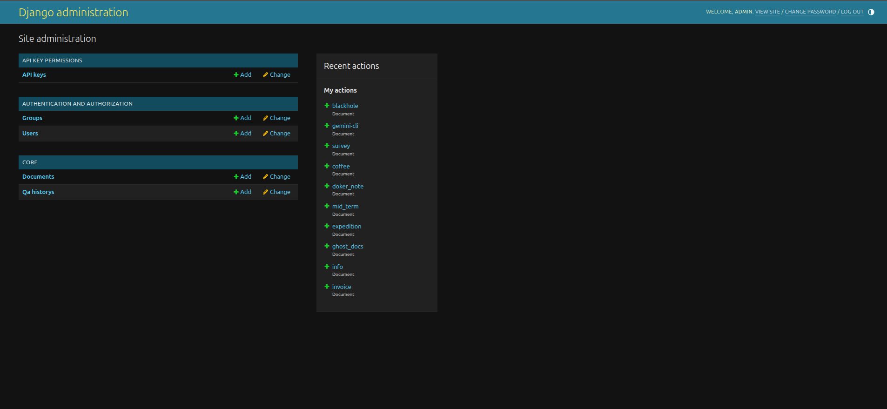

### API-key management

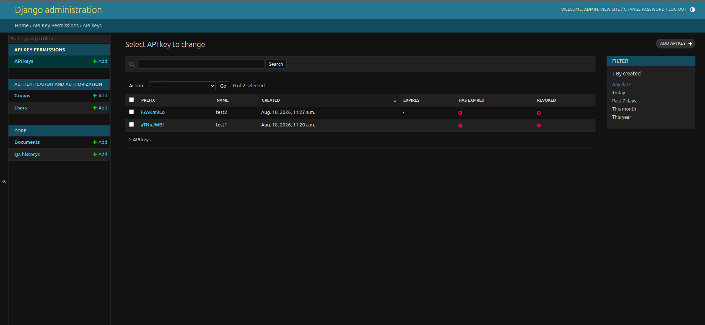

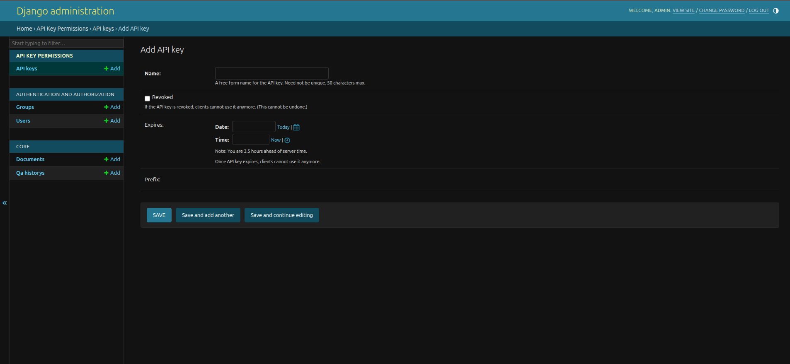

### User management

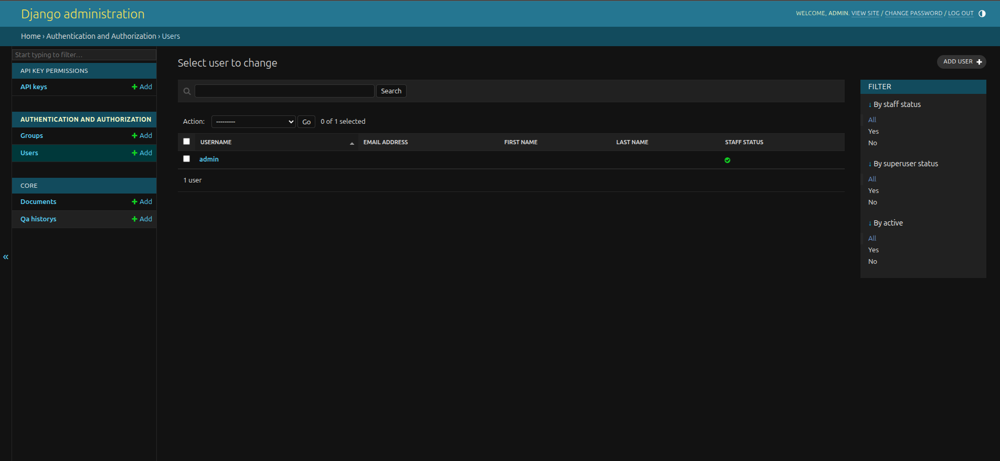

## Knowledge base management

Upload supported files from Django Admin. Ingestion runs in a background thread and exposes progress and final status in the document record.

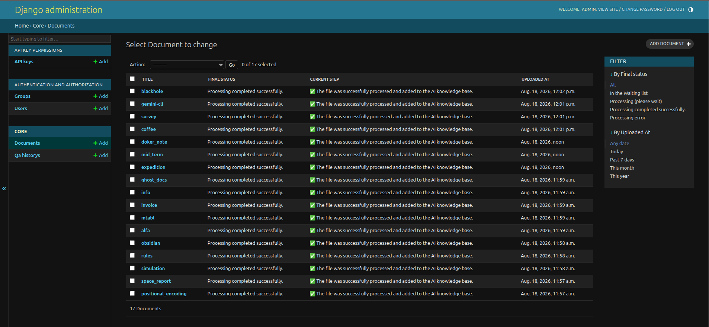

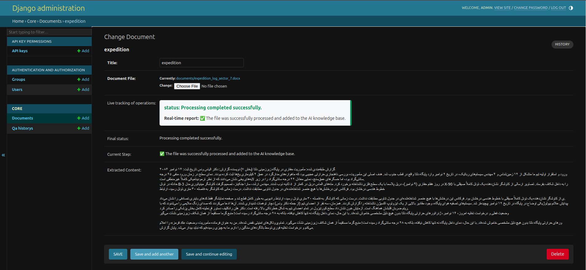

### Deletion behavior

Deleting a `Document` through Django Admin invokes the model's overridden `delete()` method. It removes the physical uploaded file, deletes matching embeddings from ChromaDB, and clears the document's BM25 data. This keeps the knowledge base synchronized and prevents deleted content from resurfacing as a ghost document.

## Q&A history & analytics

Each request can be inspected in Admin, including its question, generated answer, status, latency, selected chunks, score metadata, and model information.

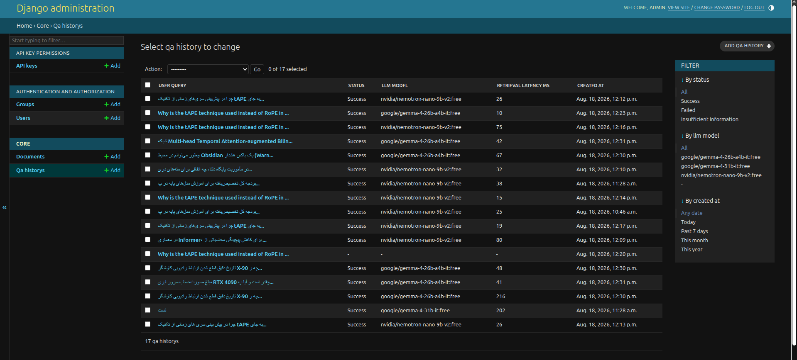

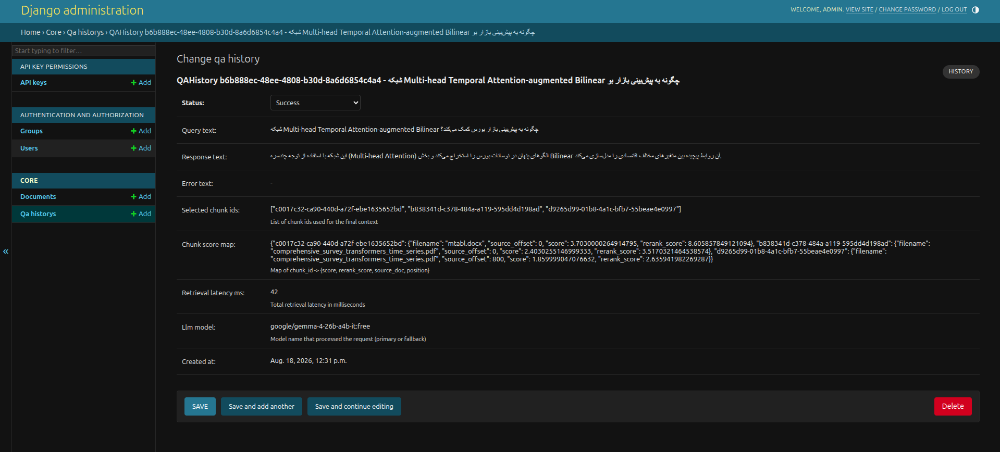

## API usage & chat interface

### Secure web chat

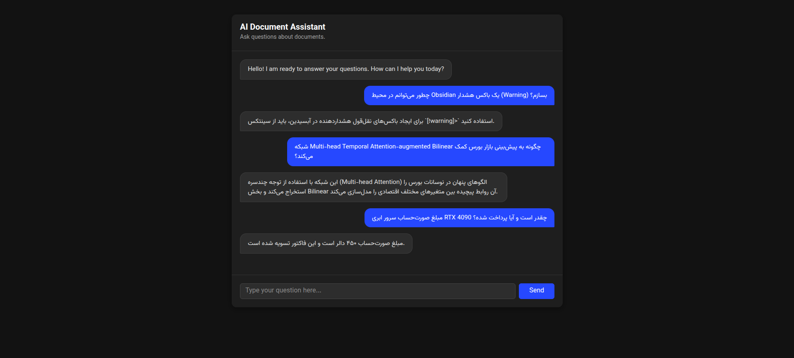

### Postman request

Configure a `POST` request to `http://localhost:8000/api/ask/` with these values:

| Setting | Value |
| --- | --- |
| Headers | `Content-Type: application/json` and `X-API-Key: YOUR_API_KEY` |
| Body | Raw JSON: `{ "question": "Your question" }` |

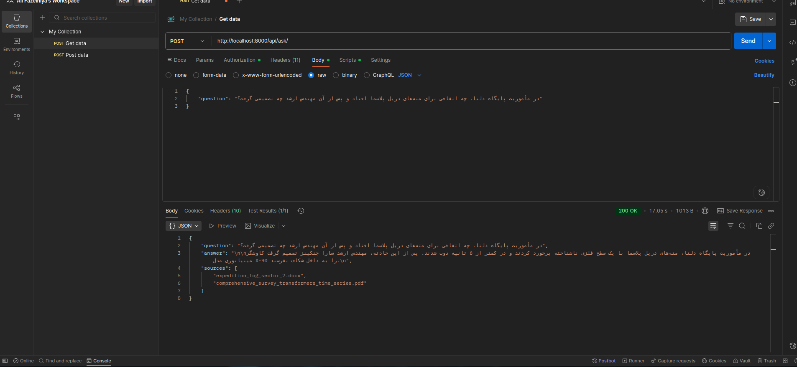

### Terminal request

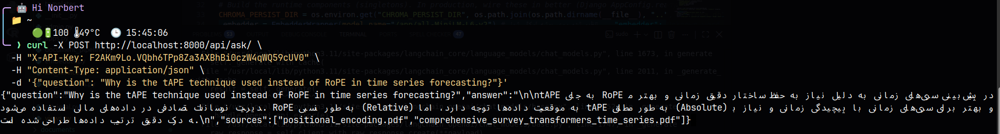

## Operations

```bash
# Inspect service state
docker compose ps

# Follow application logs
docker compose logs -f web

# Stop containers while retaining project-local data
docker compose down
```

## Production considerations

- Replace Django's development secret key, set `DEBUG=False`, and configure `ALLOWED_HOSTS`.
- Terminate TLS at a trusted reverse proxy and restrict network access to the service.
- Store API keys and OpenRouter credentials in a secrets manager; rotate and revoke keys routinely.
- Use a durable worker system such as Celery for ingestion workloads that require retries, monitoring, or horizontal scale.
- Move SQLite, uploaded files, and vector storage to managed, durable services appropriate to your deployment.
