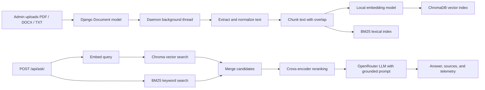
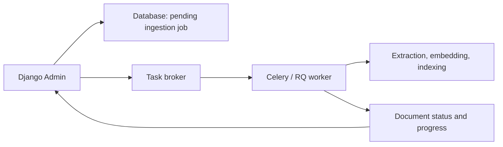

# سیستم RAG ترکیبی با جنگو (Django) و داکر (Docker) — راهنمای مصاحبه فنی

> [!abstract]
> این سند شما را آماده می‌کند تا یک سیستم RAG ترکیبی مبتنی بر جنگو و داکر را در سطح یک مهندس ارشد (Senior Engineer) توضیح داده و از آن دفاع کنید. تمرکز این سند بر اهداف طراحی، جزئیات پیاده‌سازی، حالت‌های خرابی، سبک‌سنگین کردن‌ها (trade-offs) و تکامل معتبر برای محیط پروداکشن (production) است.

## ۱. روایت پروژه: توضیح ۹۰ ثانیه‌ای

> [!tip]
> پاسخ مصاحبه را با بیان مسئله شروع کنید، سپس معماری و در نهایت سبک‌سنگین کردن‌ها را توضیح دهید. با فهرست کردن کتابخانه‌ها شروع نکنید.

من یک سیستم پرسش و پاسخ مبتنی بر سند با استفاده از تولید تقویت‌شده با بازیابی (RAG) ساختم. کاربران اسناد PDF، DOCX یا متنی را از طریق پنل ادمین جنگو آپلود می‌کنند. سیستم محتوای آن‌ها را استخراج و نرمال‌سازی می‌کند، آن‌ها را به قطعات (chunks) دارای همپوشانی تقسیم می‌کند، امبدینگ‌های (embeddings) محلی ایجاد کرده و آن قطعات را در ChromaDB ذخیره می‌کند. به موازات آن، یک ایندکس BM25 برای بازیابی لغوی (lexical) می‌سازد.

هنگامی که کاربری سوالی می‌پرسد، سیستم **بازیابی ترکیبی (hybrid retrieval)** را اجرا می‌کند: جستجوی برداری معنایی از طریق ChromaDB و جستجوی کلمات کلیدی دقیق از طریق BM25. سیستم مجموعه‌های کاندیدا را ادغام می‌کند، آن‌ها را با یک cross-encoder رتبه‌بندی مجدد (rerank) می‌کند و قوی‌ترین قطعات را به یک LLM میزبانی‌شده در OpenRouter همراه با یک پرامپت سخت‌گیرانه برای پاسخ مستند ارسال می‌کند. این API پاسخ و نام فایل‌های منبع را برمی‌گرداند.

تمرکز مهندسی به جای صرفاً کار کردن یک نسخه دمو، بر قابلیت اطمینان عملیاتی بود: کش کردن Docker BuildKit سرعت ساخت مجدد (rebuild) را افزایش می‌دهد؛ در صورت در دسترس نبودن منابع NLTK، یک راهکار جایگزین (fallback) توکنایزر از خرابی جلوگیری می‌کند؛ پردازش پس‌زمینه (background ingestion) رابط کاربری ادمین را پاسخگو نگه می‌دارد؛ و وضعیت سند به همراه پیام‌های پیشرفت، فرآیند پردازش را قابل مشاهده (observable) می‌کند.

> [!info]
> قوی‌ترین چارچوب‌بندی این است: **«این یک معماری RAG توسعه محلی است که به طور صریح به عملکرد، قابلیت اطمینان و مشاهده‌پذیری پرداخته و مرزهای مشخصی برای مقاوم‌سازی در محیط پروداکشن دارد.»**

---

## ۲. معماری سیستم



### ۲.۱ مسیر دریافت و پردازش (Ingestion path)

مدل `Document` در جنگو پس از ذخیره یک فایل تازه آپلود شده، پردازش را آغاز می‌کند. یک thread پس‌زمینه (daemon thread) پایپ‌لاین پردازش را اجرا می‌کند:

۱. استخراج متن با لودرهای مخصوص هر فرمت:
   - فایل‌های PDF از طریق `PyMuPDFLoader`.
   - فایل‌های DOCX از طریق `Docx2txtLoader`.
   - متن ساده (Plain text) از طریق دی‌کد کردن UTF-8 با تحمل خطا (error tolerance).
۲. نرمال‌سازی فاصله‌ها و خطوط خالی.
۳. قطعه‌بندی (Chunking) متن با استفاده از پنجره کاراکتری ۱۰۰۰ تایی با همپوشانی ۲۰۰ کاراکتری.
۴. تولید امبدینگ با استفاده از مدل محلی `all-MiniLM-L6-v2` Sentence Transformer.
۵. ذخیره قطعات و امبدینگ‌ها در کالکشن `documents` در Chroma.
۶. توکنایز کردن قطعات و افزودن آن‌ها به یک ایندکس ذخیره‌شده BM25.
۷. به‌روزرسانی وضعیت رکورد جنگو و پیام پیشرفت در طول پایپ‌لاین.

همپوشانی مهم است. اگر یک قطعه در وسط یک استدلال پایان یابد و قطعه بعدی پس از آن شروع شود، انسجام معنایی از بین می‌رود. همپوشانی باعث می‌شود اطلاعات مرزی در قطعات مجاور در دسترس باشند. مقادیر دقیق ۱۰۰۰/۲۰۰ به جای اینکه ثابت‌های جهانی باشند، پارامترهای تنظیمی هستند: آن‌ها پیوستگی متن و دقت بازیابی را با اندازه ایندکس و هزینه امبدینگ سبک‌سنگین می‌کنند (trade-off).

### ۲.۲ مسیر پرسمان (Query path)

در اندپوینت `POST /api/ask/`، سیستم کارهای زیر را انجام می‌دهد:

۱. پرسمان (query) کاربر را امبد می‌کند.
۲. کاندیداهای برتر را با استفاده از شباهت برداری از Chroma بازیابی می‌کند.
۳. کاندیداهای برتر را با استفاده از ارتباط لغوی از BM25 بازیابی می‌کند.
۴. قطعات کاندیدا را ادغام و موارد تکراری را حذف می‌کند (Deduplicate).
۵. کاندیداهای ادغام‌شده را با یک cross-encoder رتبه‌بندی مجدد (rerank) می‌کند.
۶. یک پنجره متنی (context window) نهایی کوچک را انتخاب می‌کند.
۷. مدل زبانی (LLM) را با دستورالعمل‌هایی فرامی‌خواند تا فقط از متن ارائه‌شده و به زبان کاربر پاسخ دهد.
۸. تله‌متری پرسمان را ذخیره کرده و پاسخ را به همراه نام منابع برمی‌گرداند.

> [!warning]
> مدل نهایی، سیستم بازیابی نیست. کیفیت RAG در درجه اول به استخراج، قطعه‌بندی و میزان یادآوری (recall) در بازیابی محدود می‌شود. یک LLM پیشرفته نمی‌تواند به‌طور قابل اعتمادی از شواهدی که هرگز بازیابی نشده‌اند، پاسخی ارائه دهد.

---

## ۳. چرا جستجوی ترکیبی: ChromaDB + BM25

### ۳.۱ ضعف جستجوی صرفاً برداری

دیتابیس ChromaDB بردارهای امبدینگ متراکم (dense) را ذخیره می‌کند. جستجوی برداری ارزشمند است زیرا معنای مفهومی را حتی زمانی که کلمات تغییر می‌کنند، مطابقت می‌دهد. پرسمانی مانند «نتیجه اصلی پروژه چیست؟» می‌تواند قطعه‌ای شامل «تحویل‌دادنی‌های نهایی» را بازیابی کند، حتی اگر عبارت دقیق *نتیجه اصلی* وجود نداشته باشد.

با این حال، زمانی که یک پرسمان به رشته‌های دقیق وابسته است، بازیابی متراکم می‌تواند عملکرد ضعیفی داشته باشد، از جمله:

- شناسه‌های فایل، شماره فاکتورها، نام APIها، کدهای خطا، سرواژه‌ها (acronyms)، یا شناسه‌های محصول (SKU).
- اصطلاحات نادری که توسط یک مدل امبدینگ عمومی به خوبی بازنمایی نمی‌شوند.
- پرسمان‌هایی که در آن‌ها یک کلمه کلیدی دقیق، معنی مورد نظر را به طور اساسی تغییر می‌دهد.

به عنوان مثال، سوالی درباره `CHROMA_PERSIST_DIR` باید به شدت از قطعه‌ای که شامل این نام پیکربندی دقیق است، حمایت کند. یک امبدینگ معنایی ممکن است متن‌های مرتبط با استقرار (deployment) را بازیابی کند اما تنظیمات دقیق را از دست بدهد.

### ۳.۲ ضعف جستجوی صرفاً BM25

الگوریتم BM25 یک الگوریتم رتبه‌بندی لغوی است. این الگوریتم به اسنادی که حاوی کلمات مهم پرسمان هستند پاداش می‌دهد، در حالی که فراوانی کلمات و طول سند را کنترل می‌کند. برای شناسه‌های دقیق و تطابق واژگان عالی است، اما به طور ذاتی نمی‌تواند پارافریز کردن یا معادل‌سازی مفهومی را درک کند.

برای پرسمانی مانند «چگونه برنامه از قفل شدن رابط مدیریت جلوگیری می‌کند؟»، یک ایندکس صرفاً کلیدواژه‌ای ممکن است عبارتی با این لحن را از دست بدهد: «یک thread پس‌زمینه از یخ زدن پنل ادمین جلوگیری می‌کند.»

### ۳.۳ شهود و فرمول BM25

برای یک پرسمان $Q$ و سند (یا قطعه) $D$، فرمول BM25 معمولاً به این شکل بیان می‌شود:

$$
\operatorname{BM25}(D,Q) = \sum_{t \in Q}
\operatorname{IDF}(t)
\cdot
\frac{f(t,D) \cdot (k_1 + 1)}
{f(t,D) + k_1 \cdot \left(1-b+b\cdot\frac{|D|}{\operatorname{avgdl}}\right)}
$$

جایی که:

- $f(t,D)$ فراوانی واژه $t$ در قطعه $D$ است.
- $|D|$ طول قطعه است و $\operatorname{avgdl}$ میانگین طول قطعات است.
- $k_1$ اشباع فراوانی واژه را کنترل می‌کند؛ تکرارهای بیشتر کمک می‌کنند، اما با بازدهی نزولی (diminishing returns).
- $b$ نرمال‌سازی طول را کنترل می‌کند.
- $\operatorname{IDF}(t)$ به واژه‌های نادرتر اهمیت بیشتری می‌دهد.

یک واژه فرکانس معکوس سند (Inverse Document Frequency) معمولی عبارت است از:

$$
\operatorname{IDF}(t) = \log\left(\frac{N-n_t+0.5}{n_t+0.5}+1\right)
$$

در اینجا، $N$ تعداد کل قطعات ایندکس شده و $n_t$ تعداد قطعاتی است که شامل واژه $t$ هستند.

> [!info]
> در یک مصاحبه، فرمول را فقط پس از توضیح هدف آن بیان کنید: BM25 قطعاتی را که شامل کلمات کلیدی نادر و متمایزکننده هستند، در اولویت قرار می‌دهد، در حالی که از سوگیری به سمت قطعات طولانی یا بمباران کلمات کلیدی (keyword stuffing) جلوگیری می‌کند.

### ۳.۴ استراتژی ترکیبی

این پروژه کاندیداها را به طور مستقل از Chroma و BM25 بازیابی می‌کند، آن‌ها را بر اساس شناسه قطعه (chunk ID) ترکیب می‌کند، و سپس مجموعه ادغام‌شده را به یک cross-encoder برای رتبه‌بندی مجدد می‌فرستد. این یک **معماری اجتماع کاندیداها (candidate-union architecture)** کاربردی است:

$$
C_{hybrid} = \operatorname{unique}(C_{vector} \cup C_{BM25})
$$

این معماری میزان یادآوری (recall) را بهبود می‌بخشد، زیرا هر کدام از روش‌های بازیابی می‌توانند یک قطعه مرتبط را پیشنهاد دهند. سپس cross-encoder ارزیابی دقیق‌تر و پرهزینه‌تر ارتباط بین پرسمان و قطعه را فقط روی یک مجموعه محدود از کاندیداها انجام می‌دهد.

| لایه | وظیفه اصلی | دلیل استفاده |
| --- | --- | --- |
| بازیابی برداری Chroma | یادآوری معنایی | یافتن پارافریزها و محتوای مرتبط مفهومی |
| BM25 | یادآوری لغوی | یافتن اصطلاحات دقیق، شناسه‌ها و واژگان نادر |
| رتبه‌بند مجدد Cross-encoder | دقت (Precision) | پرسمان و قطعه را با هم امتیازدهی می‌کند و ترتیب نهایی قوی‌تری تولید می‌کند |
| مدل LLM مستند | ترکیب (Synthesis) | شواهد بازیابی شده را به یک پاسخ مختصر به زبان طبیعی تبدیل می‌کند |

### ۳.۵ یک هشدار فنی مهم: کالیبراسیون امتیازها

فواصل Chroma و امتیازات ارتباط BM25 به طور طبیعی قابل مقایسه نیستند. یک رتبه‌بند ترکیبی در سطح پروداکشن نباید به سادگی مجموعه‌ای از امتیازات خام را مرتب کند، زیرا مقیاس و جهت امتیازها ممکن است متفاوت باشد. رتبه‌بندی مجدد با cross-encoder در سیستم فعلی، محافظ اصلی در برابر این مشکل است.

رویکردهای قوی‌تر در آینده شامل موارد زیر است:

- **ادغام رتبه متقابل (RRF یا Reciprocal Rank Fusion)**: به جای امتیازات خام، موقعیت‌های رتبه‌بندی را ادغام می‌کند.

$$
\operatorname{RRF}(d)=\sum_{r \in R}\frac{1}{k+\operatorname{rank}_r(d)}
$$

- نرمال‌سازی امتیاز، مانند نرمال‌سازی min-max یا z-score، فقط در زمانی که توزیع امتیازها پایدار و شناخته‌شده باشد.
- یادگیری برای رتبه‌بندی (Learning-to-rank) در زمانی که قضاوت‌های ارتباط (relevance judgments) برچسب‌گذاری شده در دسترس باشند.

> [!tip]
> یک پاسخ در سطح ارشد به این تمایز اذعان می‌کند. بگویید: **«ما از ترکیب (union) به علاوه رتبه‌بندی مجدد برای محافظت از کیفیت بازیابی استفاده کردیم. اگر بخواهیم آن را مقیاس‌پذیر کنیم، من ادغام را به صورت صریح با RRF انجام می‌دهم و آن را با یک مجموعه پرسمان برچسب‌گذاری شده ارزیابی می‌کنم.»**

---

## ۴. چالش‌های زیرساخت داکر

### ۴.۱ تله مجوزهای bind-mount در لینوکس

کانتینر برنامه از یک کاربر زمان اجرای غیر روت (`appuser`) استفاده می‌کند که یک رویکرد امنیتی صحیح است. در طول ساخت ایمیج (image build)، فایل‌های پروژه را می‌توان با دستور `--chown=appuser:appuser` کپی کرد، بنابراین آن‌ها به درستی در داخل ایمیج تغییرناپذیر (immutable) تحت مالکیت این کاربر قرار می‌گیرند.

تله زمانی ظاهر می‌شود که Docker Compose دایرکتوری پروژه هاست (host) را اصطلاحاً bind-mount می‌کند:

```yaml
volumes:
  - .:/app
```

در زمان اجرا، این mount جایگزین پوشه `/app` از روی ایمیج می‌شود. مالکیت و مجوزهای قابل مشاهده در داخل کانتینر اکنون توسط سیستم‌فایل هاست لینوکس تعیین می‌شود، نه `chown` انجام شده در Dockerfile. بنابراین، یک ایمیج به درستی ساخته شده همچنان ممکن است در زمان اجرا با شکست مواجه شود:

```text
PermissionError: [Errno 13] Permission denied: '/app/chroma_db/...'
```

این مشکل اغلب روی موارد زیر تأثیر می‌گذارد:

- نوشتن در SQLite (فایل `db.sqlite3`)
- فایل‌های آپلود شده در `documents/`
- ذخیره‌سازی ChromaDB در `chroma_db/`
- فایل pickle ذخیره‌سازی BM25.

> [!warning]
> دستور `COPY --chown` مشکل bind mount هاست را حل **نمی‌کند**. Mount مورد نظر، پس از شروع کانتینر، جایگزین آن مکان در سیستم فایل می‌شود.

### ۴.۲ نحوه توضیح دقیق علت اصلی

مجوزهای لینوکس بر اساس UID/GID عددی هستند، نه نام کاربری داکر. اگر دایرکتوری هاست متعلق به UID هاست با شماره `1000` باشد، اما `appuser` در کانتینر دارای UID `1001` باشد، دایرکتوری mount شده ممکن است برای پردازش قابل نوشتن نباشد. در مقابل، محیط‌های Docker Desktop ممکن است برخی از رفتارهای مجوز هاست را پنهان یا مجازی‌سازی کنند که این امر باعث می‌شود این باگ فقط پس از استقرار در لینوکس بومی ظاهر شود.

### ۴.۳ راه‌حل‌ها و سبک‌سنگین کردن آن‌ها

| راه‌حل                                          | بهترین برای                                 | معایب / سبک‌سنگین کردن                                                                       |
| ----------------------------------------------- | ------------------------------------------- | -------------------------------------------------------------------------------------------- |
| اجرای کانتینر با UID/GID تطابق‌یافته            | توسعه محلی لینوکس                           | نیاز به ارسال شناسه هاست به ایمیج یا Compose دارد                                            |
| Chown کردن دایرکتوری‌های قابل نوشتن هاست        | سیستم توسعه کنترل‌شده یا راه‌اندازی استقرار | مالکیت هاست را تغییر می‌دهد؛ ممکن است در محیط‌های اشتراکی نامناسب باشد                       |
| Named volumes برای داده‌های تغییرپذیر (mutable) | ذخیره‌سازی داکر مقاوم و شبیه به پروداکشن    | بررسی مستقیم از طریق هاست راحت نیست                                                          |
| جدا کردن مسیرهای داده از bind mount سورس‌کد     | توسعه                                       | نیاز به طراحی دقیق حجم (volume) دارد                                                         |
| اجرا به عنوان root                              | فقط برای عیب‌یابی کوتاه‌مدت                 | امنیت حداقل-امتیاز (least-privilege) را تضعیف می‌کند؛ به عنوان یک طراحی نهایی قابل قبول نیست |

یک طراحی قوی در Compose، سورس‌کد را تنها در جایی که نیاز است به عنوان bind mount نگه می‌دارد، در حالی که از named volumes برای ذخیره وضعیت برنامه (application state) استفاده می‌کند:

```yaml
services:
  web:
    volumes:
      - .:/app
      - rag_data:/app/chroma_db
      - sqlite_data:/app/data

volumes:
  rag_data:
  sqlite_data:
```

در پروداکشن، مدل ترجیحی به طور کلی یک ایمیج تغییرناپذیر با فضای ذخیره‌سازی پایدار اختصاصی و بدون bind mount برای سورس‌کد است.

### ۴.۴ Cache mount های Docker BuildKit

در Dockerfile، هنگام نصب وابستگی‌ها از یک BuildKit cache mount استفاده شده است:

```dockerfile
RUN --mount=type=cache,target=/root/.cache/pip \
    python -m pip install --upgrade pip setuptools wheel && \
    pip install -r /app/requirements.txt
```

بدون این mount، کش کردن لایه‌های داکر فقط تا زمانی کمک می‌کند که هر لایه قبلی بدون تغییر باقی بماند. هر تغییری که لایه نصب وابستگی را باطل کند (invalidate)، می‌تواند باعث شود که pip بسته‌ها را دوباره دانلود کند. این کار در محیط ML/RAG پرهزینه است زیرا وابستگی‌هایی مانند PyTorch، Transformers و Chroma می‌توانند حجیم باشند.

این cache mount به فرآیند ساخت، یک مکان کش دائمی که توسط BuildKit مدیریت می‌شود، می‌دهد. ابزار Pip در طول ساخت‌های آینده به فایل‌های کش‌شده مراجعه می‌کند و فقط موارد گم‌شده یا تغییر یافته را دانلود می‌کند. مهمتر از همه، این کش یک **بهینه‌سازی در زمان ساخت (build-time)** است؛ و بخشی از ایمیج نهایی در زمان اجرا نمی‌شود.

> [!info]
> منظور از «دائمی» در این زمینه، ماندگاری در بین ساخت‌های BuildKit محلی واجد شرایط است، نه یک تضمین همیشگی. پاکسازی (pruning) بیلدر داکر، جایگزینی رانر CI، جمع‌آوری زباله (garbage collection) کش، یا یک بیلدر متفاوت می‌تواند آن را حذف کند.

فایل وابستگی‌ها قبل از بقیه سورس‌کد برنامه کپی می‌شود:

```dockerfile
COPY requirements.txt /app/requirements.txt
RUN --mount=type=cache,target=/root/.cache/pip pip install -r /app/requirements.txt
COPY . /app
```

این ترتیب مهم است. ویرایش سورس‌کد پایتون لایه `requirements.txt` را باطل نمی‌کند، بنابراین داکر از لایه وابستگیِ قبلاً نصب‌شده، مجدداً استفاده می‌کند؛ کش pip در BuildKit به عنوان یک بهینه‌سازی اضافی در زمانی که آن لایه نیاز به اجرای مجدد دارد، باقی می‌ماند.

---

## ۵. پردازش تاب‌آور (Resilient) و رفتار برنامه

### ۵.۱ خرابی دانلود NLTK و راهکار جایگزین (fallback) توکنایزر

الگوریتم BM25 به اسناد و پرسمان‌های توکنایز شده نیاز دارد. تابع `word_tokenize` در NLTK به منابع توکنایزر قابل دانلودی از جمله `punkt` و در نسخه‌های جدیدتر NLTK به `punkt_tab` وابسته است. ساخت کانتینر یا استقرار آن ممکن است در دریافت آن‌ها با شکست مواجه شود به دلایل زیر:

- محدودیت نرخ (rate limiting) هاستِ پکیج
- قطعی موقت شبکه یا خرابی DNS
- محیط‌های ایزوله از شبکه (air-gapped)
- پیکربندی پراکسی / TLS
- تغییر ساختار پکیج منابع.

اگر توکنایز شدن یک وابستگی سخت (hard dependency) بود، آپلود سند و پرسش و پاسخ ممکن بود به طور کامل با شکست مواجه شود، حتی با وجود اینکه یک توکنایزر ساده‌تر برای بازیابی لغوی پایه کافی می‌بود.

سیستم ابتدا سعی می‌کند منابع NLTK مورد نیاز را پیدا کند. در صورت عدم دسترسی، به این روش تغییر مسیر می‌دهد (fallback):

```python
text.lower().split()
```

این انتخاب از اصل کاهش تدریجی کیفیت (graceful degradation) پیروی می‌کند:

- توکنایزر ترجیحی مرزهای توکن بهتری را ارائه می‌دهد، به خصوص در اطراف علائم نگارشی.
- راهکار جایگزین، در دسترس بودن سرویس را حفظ کرده و از کرش کردن سرور جلوگیری می‌کند.
- لاگ کردن (Logging) به اپراتورها هشدار می‌دهد که کیفیت بازیابی ممکن است کاهش یابد.

> [!warning]
> یک توکنایزر بر اساس فضای خالی (whitespace) یک راهکار برای قابلیت اطمینان است، نه یک توکنایزر زبان‌شناختی معادل. این روش می‌تواند برای متون پر از علائم نگارشی، زبان‌های بدون فاصله، و موارد خاص نرمال‌سازی یونیکد، دقت کمتری داشته باشد.

برای یک سیستم چندزبانه در محیط پروداکشن، از توکنایزری استفاده کنید که به طور عمدی برای زبان‌های اسناد انتخاب شده باشد، منابع آن را نسخه‌بندی کرده و در داخل ایمیج بسته‌بندی کنید، فعال‌سازی راهکار جایگزین را مانیتور کنید، و کیفیت بازیابی را در هر دو حالت آزمایش کنید.

### ۵.۲ فریز شدن پنل ادمین جنگو: گلوگاه CPU در امبدینگ

آپلود سند به تنهایی فقط قدم اول است. پردازش (ingestion) در RAG استخراج، نرمال‌سازی، قطعه‌بندی، امبدینگ، نوشتن در Chroma و ایندکس کردن در BM25 را انجام می‌دهد. فرآیند امبدینگ به طور ویژه‌ای پرهزینه است زیرا اجرای مدل عصبی را روی تعداد زیادی از قطعات انجام می‌دهد.

اگر این کار در داخل درخواست همگامِ ذخیره (synchronous save request) در پنل ادمین جنگو انجام شود، مرورگر منتظر کل پایپ‌لاین می‌ماند. این کار باعث ایجاد انجماد ظاهری ادمین، زمان‌های طولانی درخواست، احتمال تایم‌اوت شدن reverse-proxy و تجربه کاربری ضعیف می‌شود. همچنین یک worker وب را که باید به ترافیک HTTP رسیدگی کند، مشغول نگه می‌دارد.

راه‌حل در این پروژه، استفاده از thread پس‌زمینه (background threading) است:

۱. سطر مربوط به سند را ذخیره کنید.
۲. وضعیت آن را `processing` علامت‌گذاری کنید و یک پیام اولیه تنظیم کنید.
۳. یک thread از نوع daemon را برای فرآیند پردازش راه‌اندازی کنید.
۴. کنترل را بلافاصله به ادمین جنگو برگردانید.
۵. بعد از هر مرحله `progress_message` را آپدیت کنید.
۶. با رفرش کردن، view سفارشی ادمین را در حین پردازش سند وادار به نظرسنجی (poll) کنید.

این کار یک درخواست مسدودکننده (blocking) را به یک تجربه کاربری غیرهمگام (asynchronous) بدون معرفی زیرساخت مجزا تبدیل می‌کند.

> [!tip]
> نتیجه را به طور دقیق بیان کنید: **«من درخواست وب را غیرمسدودکننده (non-blocking) کردم و قابلیت مشاهده وضعیت پس‌زمینه را اضافه کردم.»** ادعا نکنید که استفاده از thread باعث می‌شود امبدینگ‌های وابسته به CPU سریع‌تر شوند؛ این کار پاسخگویی و همزمانی (concurrency) را بهبود می‌بخشد، نه ظرفیت عملیاتی (throughput) پردازش امبدینگ را.

### ۵.۳ Threading پس‌زمینه: مزایا و محدودیت‌ها

| مزیت | محدودیت |
| --- | --- |
| پیاده‌سازی ساده برای استقرار محلی کوچک | اگر پردازش مجدداً راه‌اندازی شود، کار ماندگار نخواهد بود |
| ادمین فورا پاسخ می‌دهد | Daemon thread ها ممکن است با خاموش شدن کانتینر بسته شوند |
| پیشرفت کار می‌تواند در دیتابیس جنگو ذخیره شود | فاقد مکانیزم بومی برای تلاش مجدد (retry)، زمان‌بندی (scheduling) یا پس‌رانی (backpressure) است |
| از مسدود شدن چرخه حیات درخواست جلوگیری می‌کند | وظایف سنگین برای CPU همچنان برای منابع سیستم رقابت می‌کنند |

در محیط پروداکشن، ارتقای پخته‌تر، یک معماری worker مبتنی بر صف (queue) است:



با استفاده از Celery، RQ، Dramatiq یا یک صف ابری، وظیفه می‌تواند پس از راه‌اندازی مجدد فرآیند وب زنده بماند، با استفاده از مکانیزم backoff مجدداً تلاش کند، به طور مستقل مشاهده شود و مستقل از سرورهای وب مقیاس‌پذیر باشد (scale شود). اگر مصاحبه‌کننده بپرسد که آیا thread های پایتون طراحی نهایی پروداکشن هستند، این پاسخ درست است.

### ۵.۴ باگ ذخیره‌سازی: `qa.answer` در مقابل `qa.response_text`

مدل `QAHistory` فیلدی به نام `response_text` را تعریف می‌کند. یک باگ ذخیره‌سازی خاموش رایج زمانی اتفاق می‌افتد که کد سرویس به یک ویژگی (attribute) داینامیک متفاوت مقداردهی کند، مانند:

```python
qa.answer = answer_text
qa.save()
```

آبجکت‌های ساده پایتون اجازه ویژگی‌های داینامیک را می‌دهند. جنگو لزوماً هنگام تنظیم `qa.answer` خطایی ایجاد نمی‌کند؛ این مقدار فقط در آبجکت فعلی پایتون وجود دارد و فیلدی در دیتابیس نیست. در زمان `save()`، جنگو فیلدهای مدل را سریالایز می‌کند، بنابراین `response_text` مقدار null باقی می‌ماند. این باگ فریبنده است: API می‌تواند پاسخ درستی را برگرداند در حالی که تاریخچه دیتابیس خالی به نظر می‌رسد.

مسیر صحیح ذخیره‌سازی این است:

```python
qa.response_text = answer_text
qa.save(update_fields=[
    "response_text",
    "retrieval_latency_ms",
    "selected_chunk_ids",
    "chunk_score_map",
    "llm_model",
    "status",
])
```

جریانِ پاسخ‌دهی فعلی از `qa.response_text` برای پاسخ‌های موفق استفاده می‌کند. مسیر خرابی (failure path) نیز باید از ارجاع به ویژگی ناموجود `qa.answer` اجتناب کند؛ در عوض باید یک پیام خطای ضبط شده صریح را برگرداند.

> [!warning]
> این فقط یک اشتباه تایپی در نامگذاری نیست. این نشان می‌دهد که چرا تست‌های یکپارچه‌سازی (integration tests) باید وضعیت ذخیره شده را بررسی کنند (assert)، نه صرفاً محتوای پاسخ API را.

یک تست رگرسیون (regression test) مناسب عبارت است از:

```python
response = client.post("/api/ask/", {"question": "test"}, content_type="application/json")
record = QAHistory.objects.latest("created_at")

assert response.status_code == 200
assert record.response_text == response.json()["answer"]
```

---

## ۶. مشاهده‌پذیری، صحت و امنیت

### ۶.۱ آنچه از قبل قابل مشاهده است

- وضعیت پردازش (Ingestion): در حال انتظار (pending)، در حال پردازش (processing)، تکمیل شده (completed)، یا خراب شده (failed).
- مرحله پردازش فعلی در `progress_message`.
- نظرسنجی (polling) با رفرش ادمین در حین فعال بودن کار.
- تاریخچه پرسمان از جمله متن پرسمان، متن پاسخ، مدل LLM، قطعات انتخاب شده، متادیتا امتیازات، وضعیت و تاخیر (latency) بازیابی.
- لاگ‌های برنامه برای استثناها (exceptions) و هشدارهای جایگزین (fallback) توکنایزر.

### ۶.۲ مواردی که باید در ادامه اضافه شوند

- لاگ کردن ساختاریافته JSON با شناسه‌های درخواست و سند.
- متریک‌هایی (Metrics) برای مدت زمان پردازش، تعداد قطعات در هر سند، تاخیر امبدینگ، تاخیر بازیابی، تاخیر LLM، فعال‌سازی fallback، و نرخ خطا.
- ردیابی توزیع‌شده (Distributed tracing) در طول درخواست API، بازیابی، و فراخوانی LLM.
- اندپوینت‌های سلامت (Health) و آمادگی (readiness) که بین «پردازش زنده است» و «مدل/ایندکس آماده است» تمایز قائل شوند.
- یک مجموعه ارزیابی بازیابی با سوالات نماینده، منابع مورد انتظار، و معیارهایی مانند Recall@k، MRR و وفاداری پاسخ.

### ۶.۳ امنیت و مرزهای پروداکشن

راه‌اندازی محلی عمداً توسعه-محور (development-oriented) است. یک بحث حرفه‌ای برای پروداکشن باید شامل موارد زیر باشد:

- رمزها (Secrets) از طریق یک مدیر رمز (secret manager) یا محیط استقرار تزریق می‌شوند؛ فایل `.env` هرگز کامیت نمی‌شود.
- حالت `DEBUG` در جنگو غیرفعال می‌شود، `SECRET_KEY` چرخانده و خارجی می‌شود، و `ALLOWED_HOSTS` پیکربندی می‌گردد.
- آپلودهای کاربر اعتبارسنجی نوع فایل، محدودیت حجم فایل، اسکن بدافزار در صورت نیاز و فضای ذخیره‌سازی ایزوله را دریافت می‌کنند.
- سرویس باید دسترسی سند را قبل از بازیابی مجاز بداند؛ فیلترهای متادیتا باید مرزهای مستاجر (tenant) یا کاربر را اجرا کنند.
- ریسک Prompt injection حتی با وجود بازیابی همچنان باقی است. اسناد ورودی‌های غیرقابل اعتماد هستند، بنابراین پرامپت‌های سیستم باید به وضوح محتوای سند را از دستورالعمل‌ها جدا کنند و پاسخ‌ها باید منابع را ذکر کنند.
- استفاده از SQLite و ایندکس‌های درون-فرآیندی (in-process) برای استفاده محلی مناسب است، نه برای پروداکشن چندنمونه‌ای (multi-instance). از ذخیره‌سازی رابطه‌ای مدیریت‌شده، ذخیره‌سازی برداری پایدار و یک استراتژی ایندکس‌سازی هماهنگ استفاده کنید.

---

## ۷. سوالات و پاسخ‌های مصاحبه در سطح Senior

### سوال ۱: چرا به جای استفاده از یک دیتابیس برداری به تنهایی، از هر دو دیتابیس ChromaDB و BM25 استفاده کردید؟

**پاسخ:**

من بازیابی را به عنوان یک مشکل یادآوری (recall) با دو حالت خرابی متفاوت در نظر گرفتم. امبدینگ‌های Chroma برای پارافریزهای معنایی و شباهت مفهومی مؤثر هستند، اما می‌توانند شناسه‌های تحت‌اللفظی، اصطلاحات نادر، کلیدهای پیکربندی و سرواژه‌های خاص یک دامنه را از دست بدهند. الگوریتم BM25 نقطه قوت مخالفی دارد: در تطابق‌های دقیق لغوی عالی است اما در پارافریز کردن ضعیف است. من کاندیداها را از هر دو بازیابی می‌کنم، اجتماع (union) آن‌ها را در نظر می‌گیرم و مجموعه کاندیداهای محدود شده را با یک cross-encoder مجدداً رتبه‌بندی می‌کنم. این کار پوشش معنایی، دقت لغوی و یک رتبه‌بندی نهایی قوی‌تر را بدون اجرای یک cross-encoder گران‌قیمت روی کل مجموعه (corpus) به دست می‌دهد.

برای پروداکشن، من هر بازیاب (retriever) را به طور مستقل اندازه‌گیری می‌کردم و ادغام را با ادغام رتبه متقابل (RRF) ارزیابی می‌کردم به جای اینکه امتیازات خام Chroma و BM25 را مستقیماً با هم مقایسه کنم.

### سوال ۲: چرا ادغام و مرتب‌سازی مستقیم امتیازات Chroma و BM25 خطرناک است؟

**پاسخ:**

امتیازات با معنای یکسانی کالیبره نشده‌اند. امتیاز BM25 یک امتیاز ارتباط لغوی مثبت است؛ پایگاه‌های داده برداری ممکن است فاصله‌ای را برگردانند که در آن مقادیر کمتر بهتر باشند، یا یک میزان شباهت با توزیع متفاوت ارائه دهند. مرتب‌سازی مقادیر خام می‌تواند یک سوگیری دلخواه به سمت یکی از بازیاب‌ها ایجاد کند. در این پروژه، رتبه‌بندی مجدد با cross-encoder تصمیم اصلی نهایی برای ارتباط پس از اجتماع کاندیداها است. اگر مجموعه اسناد رشد کند، من از ادغام مبتنی بر رتبه مانند RRF استفاده خواهم کرد، آن را با پرسمان‌های برچسب‌گذاری شده ارزیابی می‌کنم و معیارهای سهم هر بازیاب را ردیابی می‌کنم.

### سوال ۳: چرا از thread پس‌زمینه استفاده کردید و چرا در پروداکشن آن را نگه نمی‌دارید؟

**پاسخ:**

استفاده از Thread یک راه‌حل عمداً سبک برای یک مشکل فوری در تجربه کاربری (UX) بود: امبدینگِ وابسته به CPU باعث می‌شد درخواست همگام ادمین، فریز شده به نظر برسد. خارج کردن پردازش از مسیر درخواست، باعث شد که ادمین بلافاصله پاسخ دهد و اجازه به‌روزرسانی‌های پیشرفت ذخیره‌شده را داد. این روش برای استقرار داکر محلی و تک-فرآیندی مناسب بود.

در پروداکشن من آن را با یک صف و worker های اختصاصی جایگزین می‌کردم زیرا یک daemon thread در طول راه‌اندازی مجدد فرآیند ماندگار نیست، کنترل محدودی روی تلاش مجدد (retry) دارد و منابع را با فرآیند وب به اشتراک می‌گذارد. صف کارها باعث تأییدیه گرفتن، تلاش‌های مجدد، backoff، مقیاس‌پذیری مستقل و مشاهده‌پذیری واضح‌تر می‌شود.

### سوال ۴: خرابی مجوز bind-mount را با وجود اینکه Dockerfile دستور `chown` را اجرا می‌کند، توضیح دهید.

**پاسخ:**

دستور `chown` مالکیت را در سیستم فایل ایمیج ثابت می‌کند، اما یک bind-mount در زمان اجرا، آن مسیر ایمیج را با یک دایرکتوری هاست پوشش (overlay) می‌دهد. فایل‌های mount شده، معناشناسی UID/GID عددیِ هاست را حفظ می‌کنند. اگر کاربر غیر روتِ کانتینر با مالکیت یا مجوزهای هاست مطابقت نداشته باشد، نوشتن در SQLite، آپلودها، Chroma، یا ذخیره‌سازی BM25 با شکست مواجه می‌شود. من از در نظر گرفتن آن فقط به عنوان مشکل Dockerfile اجتناب می‌کنم: راه‌حل هم‌تراز کردن شناسه‌های زمان اجرا، در نظر گرفتن عمدی مسیرهای قابل نوشتن هاست، یا ترجیحاً استفاده از named volume ها برای وضعیت‌های تغییرپذیر (mutable) و اجتناب از bind mount در پروداکشن است.

### سوال ۵: چرا در غیاب داده‌های NLTK، به جای اینکه سریعاً با شکست مواجه شوید (fail fast)، از راهکار جایگزین (fallback) توکنایزر استفاده کردید؟

**پاسخ:**

منبع گم‌شده NLTK یک وابستگی زیرساختی است، نه دلیلی برای از کار انداختن سرویس اصلی سند. الگوریتم BM25 با وجود اینکه مرزهای دقت کمتری خواهد داشت، همچنان می‌تواند با توکنایزر whitespace کار کند. بنابراین من بین کیفیت ایده‌آل و حداقل سرویسِ قابل ارائه تمایز قائل می‌شوم: وقتی NLTK در دسترس است از آن استفاده می‌کنم، وقتی در دسترس نیست وضعیت تنزل‌یافته را لاگ می‌کنم و پردازش و جستجو را عملیاتی نگه می‌دارم. در پروداکشن، من منابع توکنایزر را در ایمیج باندل و نسخه‌بندی می‌کنم، استفاده از fallback را مانیتور می‌کنم و کیفیت وابسته به زبان را آزمایش می‌کنم تا fallback به جای یک رفتار عادی و پنهان، یک مسیر استثنایی باقی بماند.

### سوال ۶: چگونه ایندکس‌سازی را در زمانی که کاربران اسناد را مجدداً آپلود یا حذف می‌کنند، درست انجام می‌دهید؟

**پاسخ:**

من هویت سند را در متادیتای ایندکس تبدیل به یک اولویت اصلی (first-class) می‌کنم و عملیات‌های ایندکس ایدمپوتنت (idempotent) را پیاده‌سازی می‌کردم. هر قطعه باید به طور قطعی با یک شناسه سند و نسخه پردازش مرتبط باشد. هنگام جایگزینی، قبل از افزودن نسخه جدید، من تمام قطعات قبلی آن سند را حذف (یا tombstone) می‌کنم؛ هنگام حذف، ورودی‌های مربوطه را در Chroma و BM25 حذف می‌کنم. پیاده‌سازی BM25 باید از بازسازی یا حذف به طور ایمن پشتیبانی کند. من همچنین پردازش اسناد را سریالی (serialize) می‌کنم و از الگوی outbox/task استفاده می‌کنم تا بتوان وضعیت پایگاه داده و وضعیت ایندکس را پس از خرابی‌های جزئی تطبیق داد (reconcile).

### سوال ۷: چگونه از توهم زدن (hallucinating) LLM در صورتی که بازیابی شواهد ضعیفی برگرداند، جلوگیری می‌کنید؟

**پاسخ:**

پرامپتینگ تنها یکی از ابزارهای کنترل است. سیستم از یک پرامپت سخت‌گیرانهِ محدود به متن استفاده می‌کند و قطعات انتخاب شده را ثبت می‌کند، اما من آستانه‌های بازیابی، رفتار صریح «بدون پاسخ» (no-answer)، ذکر منابع (citations) و دیتاست‌های ارزیابی را نیز معرفی خواهم کرد. اگر هیچ کاندیدایی از آستانه ارتباط عبور نکرد، از فراخوانی تولیدکننده خودداری می‌کنم یا پاسخی مبنی بر "شواهد ناکافی" برمی‌گردانم. من وفاداری (faithfulness) را جدا از روانی (fluency) پاسخ ارزیابی می‌کنم، زیرا پاسخ‌های روان همچنان می‌توانند بدون پشتوانه باشند.

### سوال ۸: قبل از اینکه ادعا کنید سیستم برای پروداکشن آماده است، چه چیزی را بنچمارک می‌گیرید؟

**پاسخ:**

من یک مجموعه (corpus) ارزیابی نماینده با منابع پاسخ مورد انتظار ایجاد می‌کردم. من موفقیت استخراج، ظرفیت (throughput) ایندکس کردن، معیارهای Recall@k در بازیابی، MRR یا nDCG، افزایش عملکرد (lift) ناشی از رتبه‌بند مجدد، مستند بودن پاسخ، تأخیر p50/p95 در کل سیستم، تأخیر در صف پردازش، رفتار آپلود همزمان، و هزینه به ازای هر درخواست را اندازه‌گیری خواهم کرد. من تست‌های خرابی را برای منابع در دسترس‌نبودن NLTK، تایم‌اوت شدن LLM، فایل‌های خراب، اسناد خالی، ری‌استارت شدن worker، و ناهماهنگی ایندکس/پایگاه‌داده اجرا می‌کنم. آمادگی برای پروداکشن با رفتار قابل اندازه‌گیری تحت فشار و خرابی نشان داده می‌شود، نه با اجرای موفقیت‌آمیز یک پرسمان.

---

## ۸. یک بیانیه پایانی مختصر

> [!quote]
> «تصمیم طراحی مرکزی پروژه این بود که RAG را به عنوان یک مشکل بازیابی و عملیات سرتاسری (end-to-end) در نظر بگیریم. بازیابی ترکیبی یادآوری شواهد را بهبود می‌بخشد، رتبه‌بندی مجدد دقت را بالا می‌برد، پردازش غیرهمگام از تجربه کاربری وب محافظت می‌کند، کش کردن بیلد داکر زمان تکرار توسعه‌دهنده را بهبود می‌بخشد و راهکارهای جایگزین، در دسترس بودن را حفظ می‌کنند. برای پروداکشن، من thread محلی و ذخیره‌سازی مبتنی بر فایل را به worker های مبتنی بر صف، ذخیره‌سازی پایدار، ادغام رتبه‌بندی ارزیابی‌شده و کیفیت بازیابی قابل اندازه‌گیری ارتقا می‌دهم.»
